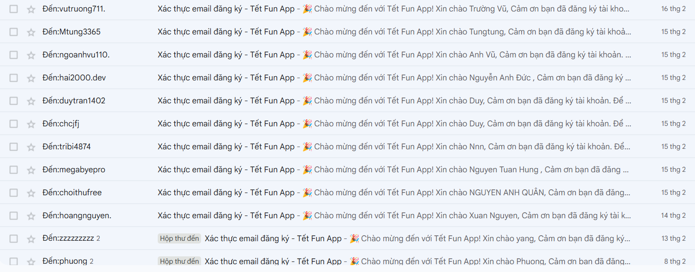
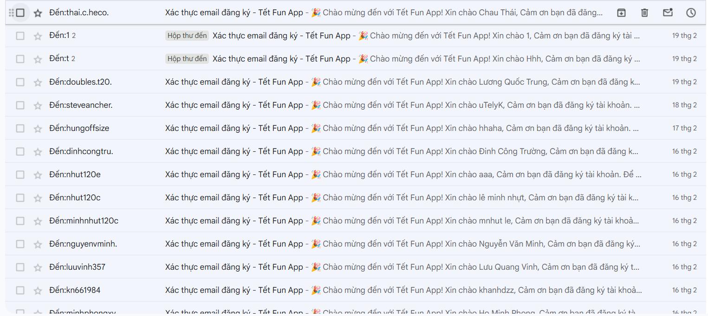
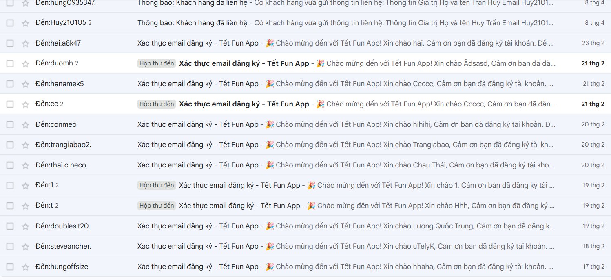
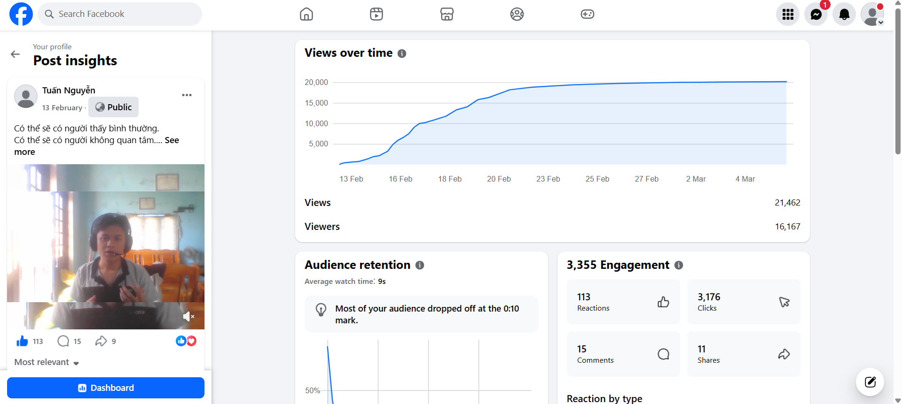

# 🎋 Tet App Backend – AI-Powered Production System

> 🚀 Production-ready backend serving **200+ real users** and achieving **21K+ demo views**
> 👑 Author: **Tuấn Nguyễn**

---

## 🌸 Introduction

**Tet App Backend** is a **scalable AI-powered backend system** built with **Spring Boot**, designed to deliver a modern and high-performance Tet application experience.

The system integrates advanced technologies such as **OpenAI API, Redis caching, and OAuth2 authentication**, ensuring **security, performance, and real-world usability**.

---

## 🏗️ System Architecture


tet-app-backend
├── config ⚙️ Security, OAuth2, JWT
├── controller 🎮 REST APIs
├── service 🧠 Business logic
├── repository 💾 Database access
├── entity 📦 Data models
├── dto 🔄 Data transfer
├── util 🔧 Utilities


---

## 🧩 Technologies

- ☕ **Spring Boot** – Backend framework  
- 🔐 **Spring Security + JWT** – Authentication & Authorization  
- 🔑 **OAuth2** – Social login  
- ⚡ **Redis** – Caching & performance optimization  
- 💾 **MySQL** – Database  
- 🤖 **OpenAI API** – AI-powered features  
- 🐳 **Docker** – Containerization  
- 🖥️ **Ubuntu VPS** – Production deployment  
- ⚛️ **React** – Frontend contribution  

---

## ✨ Key Features

- 🔐 **Secure Authentication** (JWT + OAuth2)  
- 🤖 **AI Integration** for intelligent features  
- ⚡ **Redis Caching** to improve system performance  
- 📧 **Async Email Service** (email verification)  
- 💰 **Wallet System**  
- 🏆 **Leaderboard System**  
- 🎲 **Lucky Draw Feature**  
- 🔮 **Horoscope API**  
- 📤 **File Upload Handling**  

---

## 🚀 Deployment

The system is deployed in a **real production environment**:

- 🖥️ **Ubuntu VPS**
- 🐳 **Docker containers**
- 💾 **MySQL database**
- ⚡ **Redis cache**

---

## 📊 Real Usage & Proof

### 👥 User Activity (Email Verification Logs)

> 📌 Real users registered and verified via email system





---

### 🎥 Product Demo Performance

> 📈 Strong engagement from real users

- 👁️ **21,462 Views**
- 👤 **16,167 Unique Viewers**
- 👍 **113 Reactions**
- 💬 **15 Comments**
- 🔁 **11 Shares**



---

## 🚀 Impact

- ✅ **200+ real users**
- ✅ **21K+ demo views**
- ✅ **Production deployment**
- ✅ **End-to-end full-stack system**

---

## ⚙️ Run Locally

```bash
git clone https://github.com/huutuandev/tet-app-backend.git
cd tet-app-backend
./mvnw spring-boot:run
